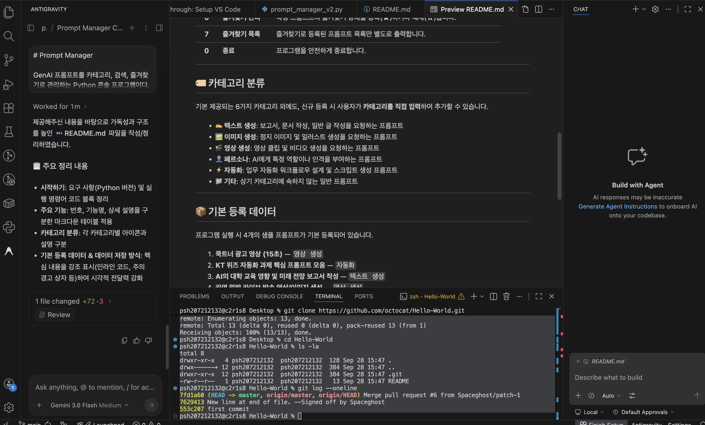
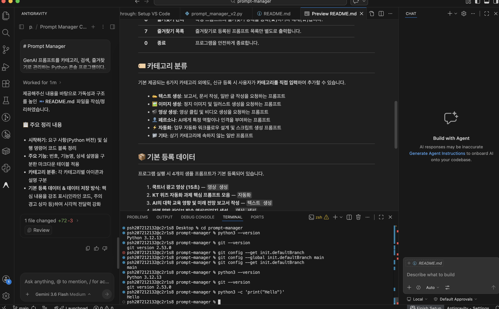
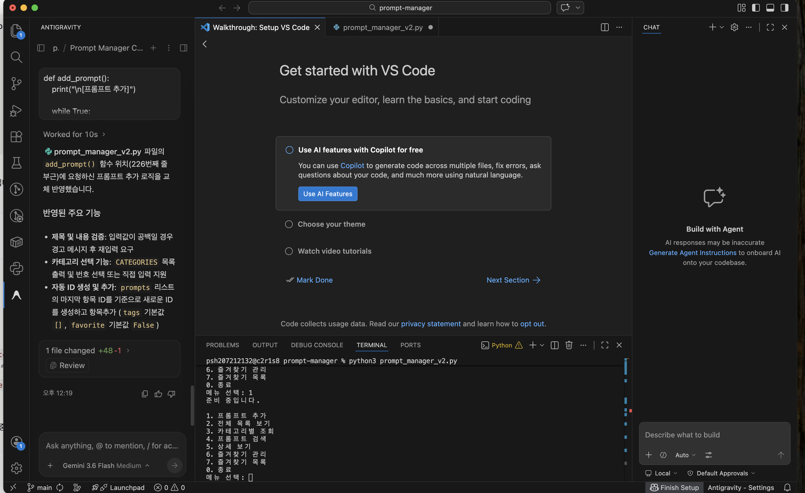
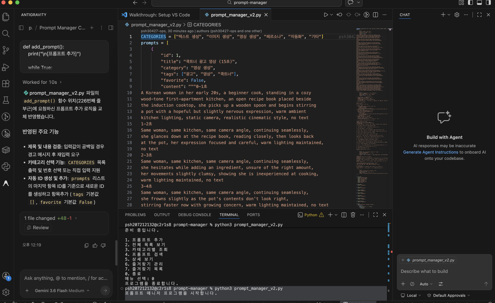
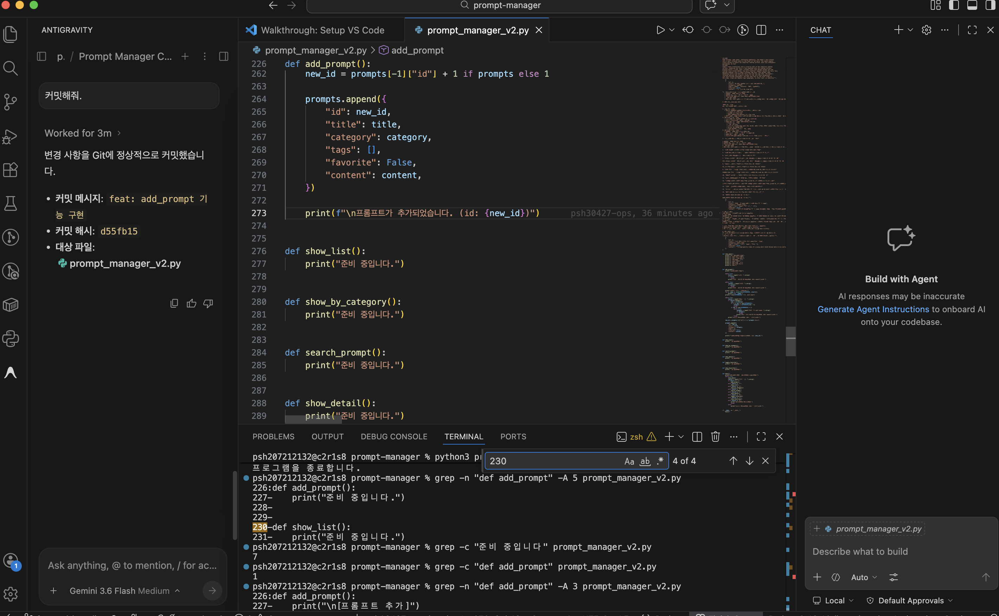
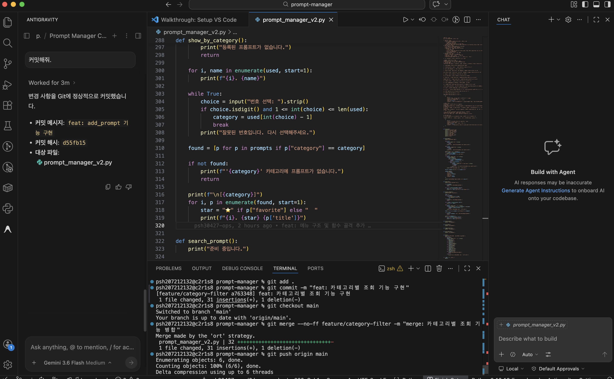
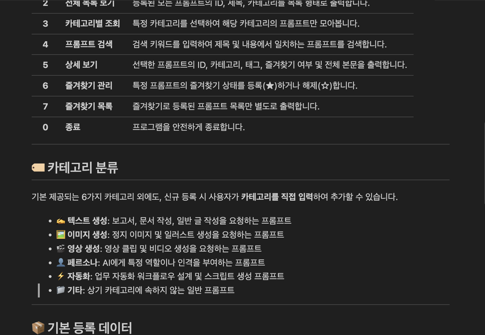

# 📝 Prompt Manager

> GenAI 프롬프트를 카테고리별 분류, 키워드 검색, 즐겨찾기 기능으로 효율적으로 관리하는 **Python 콘솔 애플리케이션**입니다.

---

## 🚀 시작하기

### 요구 사항
- **Python**: `3.10` 이상

### 설치 및 실행

```bash
# 1. 저장소 복제
git clone https://github.com/psh30427-ops/prompt-manager.git

# 2. 프로젝트 디렉토리 이동
cd prompt-manager

# 3. 프로그램 실행
python3 prompt_manager_v2.py
```

> 💡 **참고**: 실행 후 콘솔 메뉴에서 원하는 기능의 번호를 입력하여 조작할 수 있습니다. (`0` 입력 시 프로그램 종료)

---

## 📌 주요 기능

| 번호 | 기능 | 설명 |
| :---: | :--- | :--- |
| **1** | **프롬프트 추가** | 제목, 내용, 카테고리를 입력하여 새로운 프롬프트를 등록합니다. |
| **2** | **전체 목록 보기** | 등록된 모든 프롬프트의 ID, 제목, 카테고리를 목록 형태로 출력합니다. |
| **3** | **카테고리별 조회** | 특정 카테고리를 선택하여 해당 카테고리의 프롬프트만 모아봅니다. |
| **4** | **프롬프트 검색** | 검색 키워드를 입력하여 제목 및 내용에서 일치하는 프롬프트를 검색합니다. |
| **5** | **상세 보기** | 선택한 프롬프트의 ID, 카테고리, 태그, 즐겨찾기 여부 및 전체 본문을 출력합니다. |
| **6** | **즐겨찾기 관리** | 특정 프롬프트의 즐겨찾기 상태를 등록(★)하거나 해제(☆)합니다. |
| **7** | **즐겨찾기 목록** | 즐겨찾기로 등록된 프롬프트 목록만 별도로 출력합니다. |
| **0** | **종료** | 프로그램을 안전하게 종료합니다. |

---

## 🏷️ 카테고리 분류

기본 제공되는 6가지 카테고리 외에도, 신규 등록 시 사용자가 **카테고리를 직접 입력**하여 추가할 수 있습니다.

- ✍️ **텍스트 생성**: 보고서, 문서 작성, 일반 글 작성을 요청하는 프롬프트
- 🖼️ **이미지 생성**: 정지 이미지 및 일러스트 생성을 요청하는 프롬프트
- 🎬 **영상 생성**: 영상 클립 및 비디오 생성을 요청하는 프롬프트
- 👤 **페르소나**: AI에게 특정 역할이나 인격을 부여하는 프롬프트
- ⚡ **자동화**: 업무 자동화 워크플로우 설계 및 스크립트 생성 프롬프트
- 📁 **기타**: 상기 카테고리에 속하지 않는 일반 프롬프트

---

## 📦 기본 등록 데이터

프로그램 실행 시 4개의 샘플 프롬프트가 기본 등록되어 있습니다.

1. **쿡트너 광고 영상 (15초)** — `영상 생성`
2. **KT 위즈 자동화 과제 핵심 프롬프트 모음** — `자동화`
3. **AI의 대학 교육 영향 및 미래 전망 보고서 작성** — `텍스트 생성`
4. **라면 먹방 라이브 방송 영상/이미지 생성** — `영상 생성`

---

## 💾 데이터 저장 방식

- 본 프로그램의 데이터는 Python 내부 메모리(`list` & `dict`)에 저장되어 실행됩니다.
- ⚠️ **주의**: 프로그램 종료 시 추가 및 변경된 데이터는 저장되지 않으며, 재실행 시 기본 등록 데이터로 초기화됩니다.
<details>
## 실행 화면

<details>
<summary>개발 환경 확인</summary>

**Python 버전, Git 버전, 기본 브랜치 설정 및 Hello 출력**



**공개 샘플 저장소 clone 및 폴더 구조·로그 확인**



</details>

<details>
<summary>프로그램 실행 화면</summary>

**메뉴 출력 및 기능 선택**



</details>

<details>
<summary>코드 구조</summary>

**카테고리 상수 및 프롬프트 데이터**



**프롬프트 추가 기능 구현**



</details>

<details>
<summary>Git 브랜치 작업</summary>

**브랜치 생성, 커밋, main 병합 및 푸시**



</details>

<details>
<summary>README 미리보기</summary>



</details>